<!-- this overrides some styles so we get code chunks printing to pdf properly-->
<style> 
  code.hljs 
  {
    color:black !important;
    font-weight: normal !important;
  }
  pre.r 
  {
    background-color:rgb(240,240,240) !important;
    border:1px solid rgb(210,210,210) !important;
    page-break-inside: auto !important;
  }
  pre.python 
  {
    background-color:rgb(240,240,240) !important;
    border:1px solid rgb(210,210,210) !important;
    page-break-inside: auto !important;
  }
  pre.c 
  {
    background-color:rgb(240,240,240) !important;
    border:1px solid rgb(210,210,210) !important;
    page-break-inside: auto !important;
  }
  pre.bash
  {
    background-color:rgb(240,240,240) !important;
    border:1px solid rgb(210,210,210) !important;
    page-break-inside: auto !important;
  }
  .hljs-comment 
  {
    color:green !important;
    font-weight: bold !important; 
    word-break: normal !important; 
    white-space: normal !important; 
    word-wrap:normal !important;
  }
  body 
  {
    -webkit-print-color-adjust: exact !important;
  }
</style>

<!-- this overrides some styles so we get the actual paragraph and list font colours correctly printed-->
<style> 
  p {
    color: rgb(100,100,100) !important; 
  }
  li {
    color: rgb(100,100,100) !important; 
  }
</style> 


<!-- table display overrides - makes the borders for the table rows and the striped even rows-->
<style>
  table, table-condensed {
    border-collapse: collapse;
    border-spacing: 0;
    width: 100%;
    border: 1px solid #ddd;
  }
  
  tr th {
    border-bottom: 1px solid #ddd !important;
    -webkit-print-color-adjust:exact !important;
  }

  tr td {
    text-align: left;
    padding: 16px;
    border-bottom: 1px solid #ddd !important;
    -webkit-print-color-adjust:exact !important;
  }

  tr.even {
    background-color: #f2f2f2 !important;
    -webkit-print-color-adjust:exact !important;
  }

</style>


---

<!-- this is the style for the double col option-->
<style> 
.double_col 
          {
            -webkit-column-count: 2;
            -moz-column-count: 2;
            column-count: 2;
          
            -webkit-column-gap: 30px; /* Chrome, Safari, Opera */
            -moz-column-gap: 30px; /* Firefox */
            column-gap: 30px;
          }
</style>

<!-- this is the formatting for the entire document -->
<!-- <div class="double_col" align="justify"> -->
<!--<div align="justify">-->
<!--div class="double_col" align="justify"-->


<!-- sometimes you need this to force page-breaks-->
<!--
<P style="page-break-before: always">
-->


```{r echo=F, include=F}
require(knitr)
require(kableExtra)
require(png)
require(grid)
require(ggplot2)
require(gridExtra)
require(rstan)
require(bayesplot)
require(lattice)
require(reshape2)
require(MASS)
require(GGally)
```


#Problem Description
Monitoring of the natural environment has always been of interest to human civilisation.  Weather in particular, affects our day to day lives and even can affect our health and business interests.  Remote sensing from arial vehicles and satellites combined with supercomputing resources provide us with readily available high accurate weather forecasts and current condition snapshots, while, on-ground weather stations fill in the gaps and provide actual mesurements of conditions as opposed to predictions.  

It is a fact that local weather systems and effects can create micro-climates that can result in significantly different wind patterns in some areas than that which is predicted from the aforementioned remote sensing.  As a result, weather stations remain a very valuable tool for understanding weather systems.  Unfortunately, there may not be a weather station in the particular area that detailed weather observations are desired.  This is esspecially acute an issue in developing countries where there are even fewer of weather stations than are found in developed countries.  Take Bali, Indonesia for example, there are a handful (2-3) operational weather stations on the island with data available on the internet.  There are parts of the island that have strong local diurnal weather effects that can lead to local winds being completly different to the prevailing trade winds that blow accross the open ocean.  These differences are strongest in the morning to midday, the strength of the local effects and how long the differences last for are unpredictable, somedays they can be weak, other days they are strong and last for a few hours, other days they are strong and last from early morning into the early afternoon, other days the local wind remains calm all day while the open ocean tradewinds are stong.  

The solution is to build your own weather station and deploy it, primarily for measuring wind speed and direction.  The requirement is that the station be:

* cheap
* reliable
* weather-proof
* low profile
* easy to mount
* battery/solar powered
* radio connected

---

#Description of the Solution
There are some cheap commercial weather stations that can perform this task, however none have communciations ability that enables them to be deplyed away from a home.  Typically most come with a custom short range radio link connecting the outdoor station to an indoor receiver unit, mainly targeted for home use.  These cheap systems cost around $150 upwards, which is not that cheap.  Professional stations offer more reliability and communicationa options, however they get very expensive, costing 1000s of dollars.  

The solution proposed here is a bare-bones, cheap and reliable weather station that can connect to either wifi or the telecommunications network.  The prototype presented has only got wifi conenctivity currently, but adding gsm/wcdma/lte connectivity would be relatively easy, although the power considerations would be challenging.

###Systems Level Architecture
The proposed solution is a simple wind speed and wind direction meter mounted on a wooden frame.  These sensors are connected to a micro-controller unit (MCU) that is located in an insultated weather-proof enclosure.  The weather-proof enclosure houses an ATMEGA328P MCU along with a 3.7 LiPo battery, a 5v solar panel, a solar/battery power manager/regulator that controls charging the battery from the solar panel as well as supplying a constant 5v to the MCU and the peripherals.  The peripherals consist of a 5v to 3.5v DCDC converter and an ESP8266 wifi board.  This setup is shown in the following figure.

<div align="center">
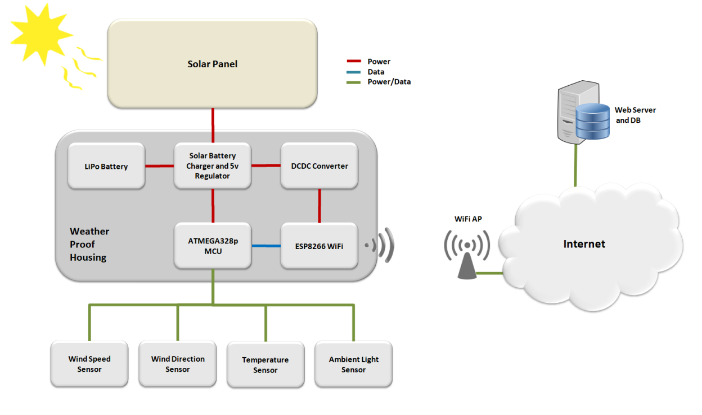
</div>  

###Operation
The MCU has 3 phases:

1. The MCU powers the sensors and takes readings for around 30s.  The current draw in this phase is around 30mA
2. The MCU powers off the sensors, powers up the WiFi board and sends data to the server ~ 30s.  The current draw in this phase is around 150mA, however there is also a high transient current spike apon ESP8266 power on which can cause the supply voltage to the ATMEGA328P to dip momentarily, this issue needed to be managed, in our case, activating the 2.7v brow-out reset function as well as placing capacitors over the supply lines to the ATMEGA328P seemed to fix it.
3. The MCU powers off the WiFi board and goes into a deep sleep mode for a varying amount of time depending on the ambient light level.  The sleep time ranges from 5 minutes daytime to 15 minutes night time as wind readings are not as interesting at night.  The current usage in this mode was ~ 4mA, it should have been lower, but there was no time to investigate.  However 4mA was still sufficiently low.

The MCU will simply cycle through these 3 phases indefintely. As can be seen from the performance data later in the report, the system was able to harvest suffient solar energy to recharge the battery, even on cloudy/stormy days.  On sunny days, the battery would fill within 2-3 hours. 

---

<P style="page-break-before: always">
#Implementation Details  
###Schematic
The following figure depicts the connections for the entire station.

<div align="center">
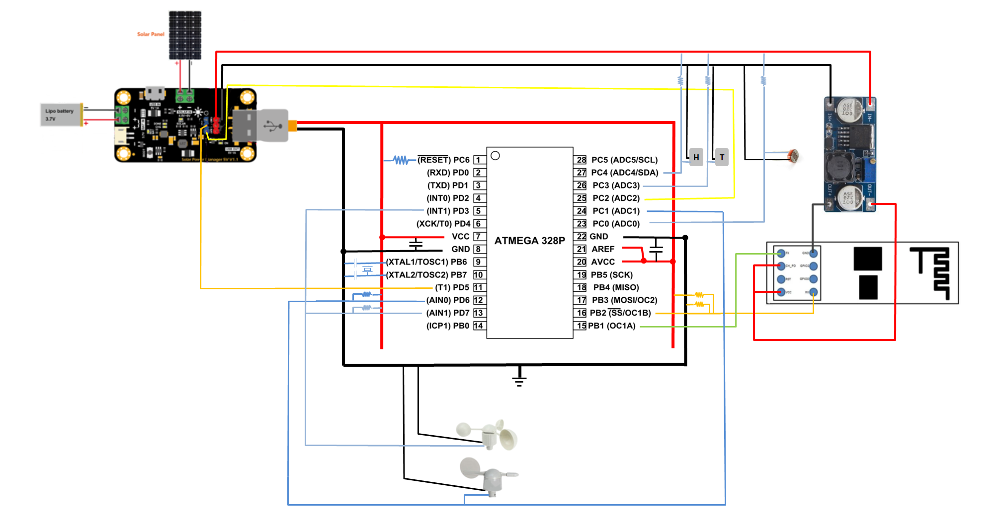
</div>  

<div align="center">
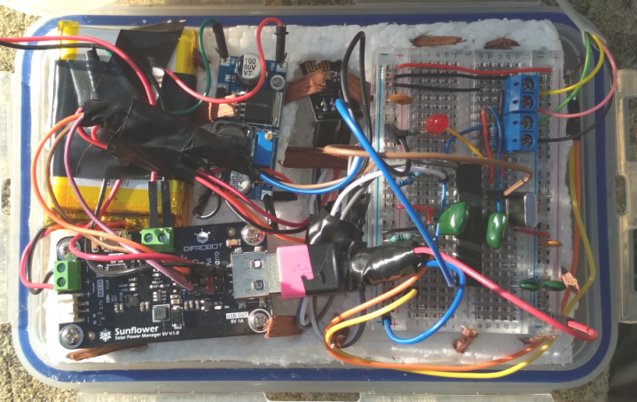
</div>  

###Micro-Controller
The system is controlled by the ATMEGA328P microcontroller chip in a breadboard.  The MCU chip is the same as that found in an Arduino Uno board, however bought standalone along with the crystal oscillator it typically costs around \$5-8. This was done to reduce the power consumption as the Arduino Uno board contains alot of uncontrollable peripheral hardware (FTDI chip, voltage regulators).  Using the Arduino Uno board the power consumption is ~ 50mA at 5v while active and 25mA at 5v while in sleep mode.  Using just the ATMEGA328P, the power consumption is around 30mA at 5v while active and 1mA at 5v in sleep mode.  

<div align="center">
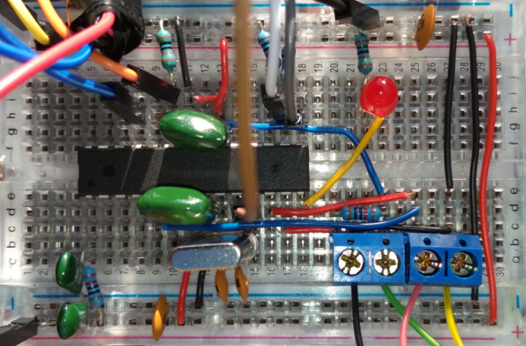
</div>  

####Connection of the standalone ATMEGA328P:

* the MCU needs to be driven by a crystal oscillator with ground tied 22pF ceramic capacitors on both legs.  It should be placed as close to the MCU pins as possible

<div align="center">
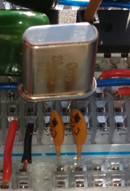
</div>  

* Both pairs of VCC and GND pins also need to be decoupled by large ceramic or film capacitors to minimise power line noise.  In this case 1uF capacitors where used along with smaller 100nF capacitors place as close to the MCU pins as possible.  Read this blog for more information, however it is confirmed that this is critical for the system to operate [5].
* The reset pin needs to be tied to VCC through a 10K pullup resistor.
* The data tx/rx pins (9,10) to the ESP8266 are using software serial as the hardware serial pins (0,1) are needed for uploading sketches.  The tx pin (10) in particular needs to use a voltage divider (10k pullup resistor and 20k pulldown resistor) to drop the 5v output to 3.3v for the ESP8266.  The rx pin (9) doesn't need anything as it can read the incoming 3.3v from the ESP8266 ok.  The baud rate used for software serial was 9600bps, this had to be first set on the ESP8266 as by default it uses 115200, which is too fast for software serial.  Programming the ESP8266 had to be done by using the arduino uno board and connecting it to the tx/rx pins.
* the wind speed sensor works by closing a circuit evey half turn, thus it had to be measured by connecting the output line from the sensor to a digital pin (with an internal 20K pullup resistor) and activating a falling level interrupt on that pin, i.e. everytime the wind speed sensor circuit closed pulling the pin to ground, the interrupt would trigger and an interrupt handling routing would measure the time since the last interrupt and thus log the current wind speed [8].
* the wind direction sensor output line was connected to an analog input pin and tied to high via a 10K pullup resistor.  For each of 16 available azimuths, the resistance of the sensor would change, thus we had to measure the voltage and convert it to an azimuth value through some lookup functions.
* the battery level, temperature and ambient light sensors all were connected to analog input pins and tied to high via 10K pullup resistors.
* one digital pin was used to control power to the wifi board, not to supply the power though, only to signal to the regulator to activate the power.  
* One digital pin was used to control and supply power to the wind direction sensor and one pin was used to supply power to the wind speed sensor as these devices had very low current draw this was ok. 

####Uploaded sketches to the ATMEGA328P via an Arduino Uno
An Arduino Uno (without chip) is required to upload sketches to the ATMEGA328P.  First you need the following connection.

<div align="center">
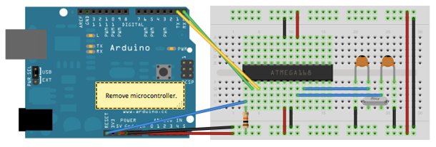
</div>  

Then you need to set the board type to Arduino Nano instead of Arduino Uno and the processor type to ATMEGA328P and you are ok to upload the sketch.  Sometimes you need to put the ATMEGA328P chip back in the Arduino Uno board and upload a sketch first if you have recently changed the bootloader or any of the low/high.extended byte fuses, then you are good to use this external method.

This is a good guide [6].

###Power
The power is supplied by a 3.7V 2000mAh LiPo battery and a small 5V 1.5W solar panel, connected to a DFRobot Sunflower battery charger and 5V regulator. This setup simultaneously charges the battery from the solar panel and provides a 5V regulated supply to the rest of the system. The Sunflower has a constant 5V regulated output as well as a user-controlled 5V regulated output that can be switched on and off via a control wire. The constant output powers the MCU and the user-controlled output powers the WiFi board via the DC/DC converter.

One of the main challenges with this project was sharing a power supply for the ATMega328P and the ESP8266. The ESP8266 drew a lot of transient current on power up before it reached its steady state of around 100-200mA. The cheap power supply did not handle this very well, resulting in voltage dips at the ATMega328P. The effect of this was unstable MCU operation, i.e. it would run for an indeterminate time (from 1 hour to 12+ hours) and then suddenly hang at which point only a hard reset or battery exhaustion could force a reset of the MCU.  The watch dog timer also became inoperative in this scenario.  This issue was not completely solved during the project, however was minimised to the point that hang states where rare using the following adjustments:

* The ESP8266 was repositioned physically to be as far away from the ATMega328P and breadboard (from around 2cm initially to around 12cm finally). This was to minimise electromagnetic energy interference to the breadboard connections. If possible the MCU would have been shielded by foil, but due to the chaotic nature of the breadboard wiring, this was not deemed practical.  Obviously in a real world scenario the whole system would be on a custom PCB, leading to less of these types of issues.
* The MCU oscillator type was set to "full swing oscillator" which involved burning the low byte fuse [6]. We found this setting gave more voltage to the crystal oscillator causing it to oscillate to larger extremes and hence be less sensitive to electrical noise. The price for this was slightly higher power usage.
* VCC-GND decoupling capacitors were used on the breadboard. This helped to minimise the voltage dips experienced by the MCU. 
* The extended byte fuse was burned to change the BOD (brown out detector) level which determines when the ATMega328P resets due to low voltage. Setting this to 4.3V helped to shed light on the actual power supply issue. The final setting was, however, the default of 2.7V.

Burning the bootloader and the fuses requires the wiring configuration shown in the following figure... 

<div align="center">
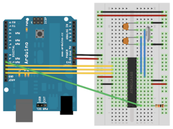
</div>  

Then use this guide and software to do it via the windows command line, [4].

###Communciations
The communications are performed by the ESP8266 wifi board (costing \$2).  This tiny board is itself a micro-controller and actually has several GPIO pins, however for this task it is simply being used as a slave wifi unit. As it runs on 3.3v as opposed to the 5v used by the ATMEGA328P, it has to be supplied via a high effiency DCDC converter which converts 5v to 3.3v (costing \$8).  The 9600bps baud data lines run between the ATMEGA328P and the ESP8266, which allow the ATMEGA328P to control the ESP8266 via AT commands to connect to a wifi hotspot and HTTP POST the sensor readings to a web server.  The readings are then processed and stored in a database for retreival by the same webserver application apon dashboard GET request from an end-user browser.

The ESP8266 01 used in this project uses an on board omni directional antenna.  This is effectively an isotropic antenna with unity gain at best.  This makes deployment simple, but also means that our effective range from the nearest WiFi AP is reduced compared to a case where we had an external directional antenna that could increase the usable range from 20-30m out to 100m in LOS cases due to the reduction in target AP pathloss and increase in interferer pathloss.  From testing, the tupperware enclosure and EPS foam insulation are both quite RF transparent meaning that placing the ESP8266 inside the enclosure had little impact on the RF pathloss to the target AP.

<div align="center">
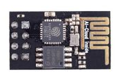
</div>  

####Changing the baud rate to 9600
The baud rate of the WiFi unit had to be changed from the default of 115200 bps to 9600 bps for use with Software Serial.  This is a dangerous action as if the wrong command is entered, the WiFi board becomes uncontrollable (becomes bricked), requiring it to need re-burning of the booloader.

<div align="center">
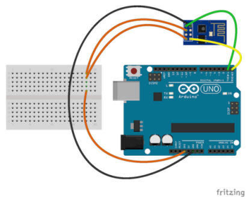
</div>  

Once you have your ESP8266 connected to the GND, 3.7v, Tx and Rx pins of your Arduino Uno and the baud rate set to 115200bps, you can issue it with AT commands to test it and configure it.

You need to send the following command exactly (no spaces) to change the baud rate:

> AT+UART_DEF=9600,8,1,0,0


####Reburning the ESP8266 Bootloader
When the ESP8266 becomes bricked, the bootloader needs to be reburned.  There are many tools out there to do this via the Arduino Uno [1][2][3].  You need to connect the ESP8266 as such:

<div align="center">
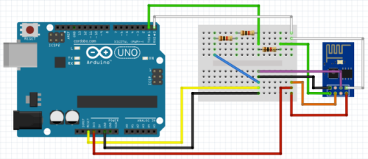
</div>  


<P style="page-break-before: always">
###Sensors
The various sensors employed were:   

* the wind speed and wind direction sensors, these are analog devices that need to be mounted in a location free from wind obstructions (higher structures within 10m).  These turned out to be the most difficult part to obtain cheaply with the final solution being to order spare parts for a commercially avaialble product for \$70 and then cutting the rj12 connector to use the bare wires.  Each sensor required a ground and a pullup measurement wire.
    * the wind speed sensor (anemometer) closed a switch every half rotation of the wind sensor, this pulled the measurement wire voltage low termporarily every half rotation.  To use this, the measurement wire needed to be connected to an interrupt enabled pin of the MCU.  The interrupt triggered by this pin falling would then calculate the wind speed based on the time passed since the previous interrupt.
    * the wind direction sensor varied the resistance based on the direction of the sensor, so the measurement wire voltage would change depending on the direction of the sensor.  Thus this was sampled by an analog input pin periodically.
    
<div align="center">
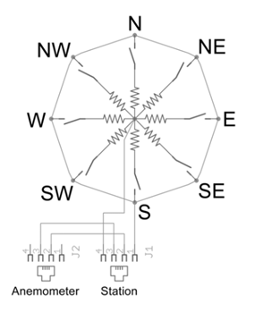
</div>  


* the temperature sensor.  Requiring a ground and a pullup measurement wire.
* the ambient light sensor.  Requiring a ground and a pullup measurement wire.
* the battery level sensor requiring only one measurement wire, this was a built-in function of the sunflower power regulator.
* the wifi rssi sensor requiring no wires as it was measured by the ESP8266 directly.

###Weather Proof Housing
As the unit needed to be placed outdoors in the weather, a weather-proof enclosure was required.  The enclosure needed to be:

* water proof
* easily servicable
* insulated against the direct midday sun to avoid MCU/battery overheating
* able of having a weather-proof cable entry point

The final solution to this was a premium water-tight silicone sealed click-lock tupperware container costing around \$5.  EPS foam was siliconed to the internal sides of the container to insulate it.  A cable entry hole was burned in one side and an electrical entry boot with a downward facing pipe was siliconed in place.  The solar panel was siliconed on the top of the housing as putting it inside halved the solar energy harvesting ability despite the tupperware material being transparent. 

<div align="center">
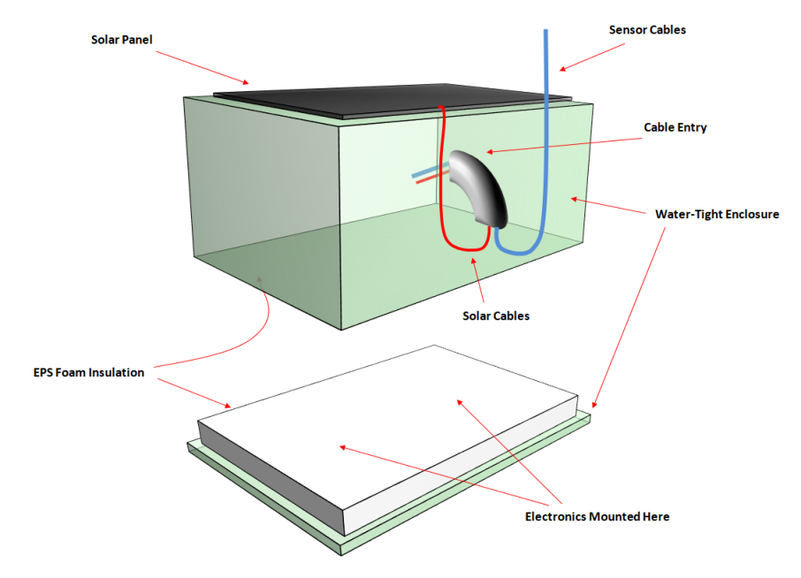
</div>  

<div class="double_col" align="justify">
<div align="center">
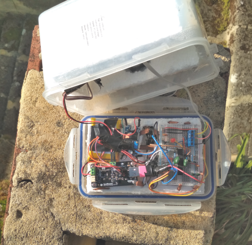
</div>  


<div align="center">
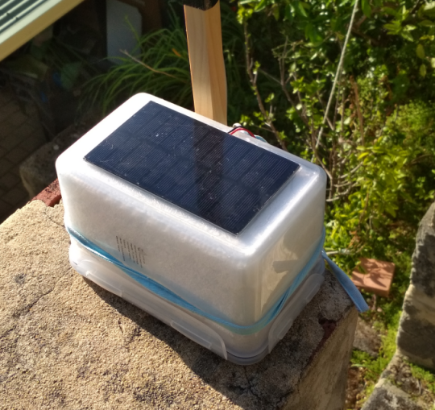
</div>  

</div>

<P style="page-break-before: always">
###Sensor Frame
The wind speed and direction sensors needed to be mounted on a frame to get them above the surrounding obstacles.  A simple wooden structure was constructed to hold the sensors as shown in the following figure.

<div class="double_col" align="justify">
<div align="center">
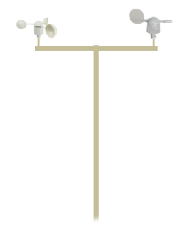
</div>  


<div align="center">
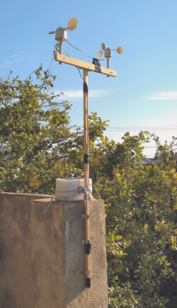
</div>  

</div>

<P style="page-break-before: always">
###MCU Software
The software running the MCU system is one arduino sketch written in C.  The general flow of the MCU code is as follows:

1. Startup
    * the pins are defined
    * the variables are reset
    * the watchdog timer interrupt is activated
2. Measurement Cycle
    * activates the wind speed interrupt
    * start the measurement cycle main timer
    * start the periodic measurement timer
    * When the periodic measurement timer expires, a measurement is taken from the wind direction sensor as well as the battery, temp and light level sensors
    * Watchdog timer (WDT), the WDT interrupt will fire every 8s, if the WDT total time is below the timeout threshold, the program continues, if not, the MCU is hard reset
    * Wind Speed Interrupt => during the measurement cycle if the wind speed sensor closes the circuit on a half rotation of the wind speed sensor, it triggers the wind speed interrupt which is handled by an ISR
    * when the main measurement timer expires the MCU deactivates the wind speed interrupt and exits the measurement cycle
3. Post Processing
    * after measuring the data, the MCU post processes it to prepare for transmission
4. Data Communications
    * the WiFi board is powered on 
    * it connects to the target AP
    * it sets up an TCP connection to the target server
    * it sends an HTTP POST request with the data payload
    * the WiFi board is powered down
5. Prepare to Sleep the MCU
    * stop the WDT interrupt
    * calculate the sleep period from the ambient light level
6. Sleep the MCU for the given sleep period
7. Wake the MCU
    * reset the counters
    * start the WDT
8. Go back to step 2
    

<div align="center">
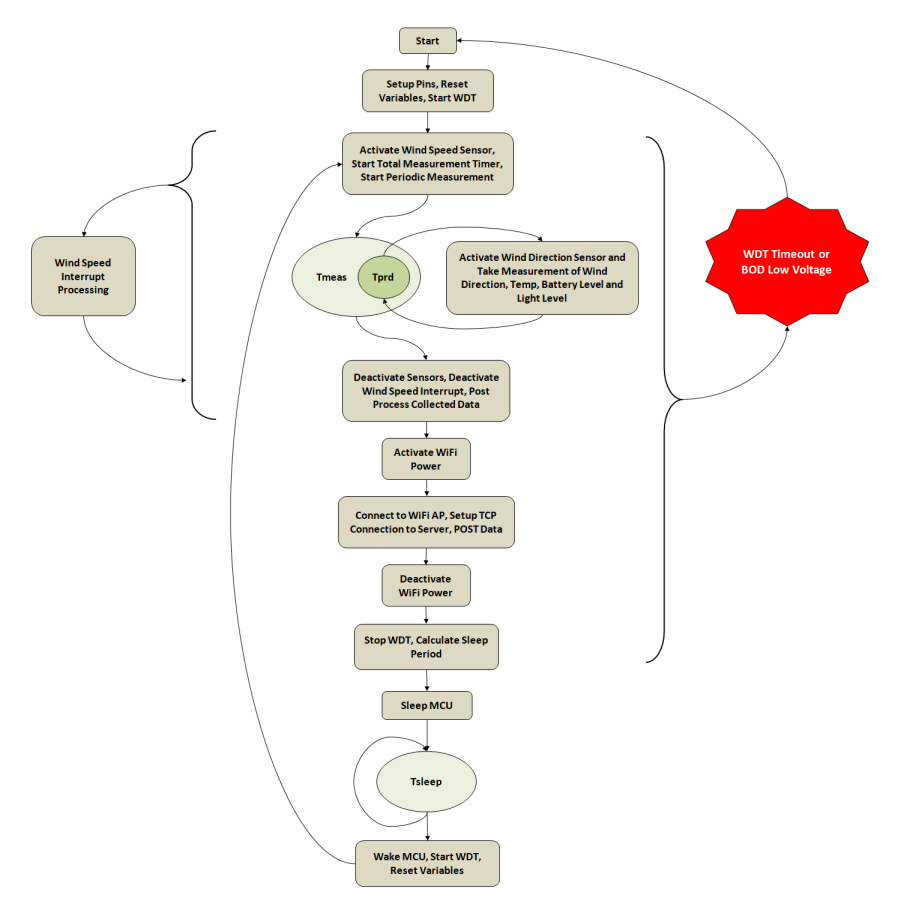
</div>  

Please see Software Appendix 1 for the actual code.

####Interrupts and BOD
Interrupts are used for the watch dog timer, the sleep timer, the wind speed sensor and BOD.  

For the case of the WDT and sleep, the interrupt is internal and we simply need to activate and configure it.  The maximum time to configure it is 8s, so to handle times longer than 8s we need to repeat it. 

For the wind speed sensor, we tie the incoming signal line to an interrupt pin on the MCU and allow it to trigger an interrupt.  We then handle the interrupt by processing the data in the ISR (Interrupt Serve Routine).

The BOD (Brown Out Detector) is an internal interrupt that is by default set to 2.7v and can be changed to 4.3v or disabled.  The BOD essentially monitors the VCC supplied voltage to the MCU, if the voltage drops below the threshold (2.7v in our case), the BOD will hard reset the MCU.  The reason for this is to prevent transient low voltage conditions from stopping the MCU oscillator clock.  When this occurs the MCU can go into a hang state that the WDT can not recover from, the only way out of a hang scenario is a hard external reset by pulling the reset pin low, which requires external intervention.  So the BOD is there to hard reset the MCU before this hang state occurs if the supply voltage is dropping.  

NOTE: as this system was using only one power supply to power both the WiFi module and the MCU, when the WiFi module was powered on, it would draw a transient current over the capacity of the battery/power supply.  This would in-turn cause a transient voltage dip in the supply voltage to the MCU.  If not handled, this voltage dip was too fast for the BOD to reset the board before it went into a hang state.  The solution to this was to use larger film type decoupling capacitors on both VCC-GND pins coming into the MCU.  This seemed to reduce the voltage dip and possibly slow it down giving the BOD time to detect the voltage drop and reset the board before any hang state occured.

###Webserver and Database
The web server and database could be anywhere and any platform.  As a raspberry pi was available, it was connected to a wifi hotspot, port forwarding enabled on the AP and a flask webserver was setup along with an sqlite database on the RP.

NOTE: as the particular AP used to host the server had a fixed IP, we could access this from the internet easily.  

The software for the webserver is simply a flask application running on Python.  The database uses sqlite which comes with Python.  To create a new database, you simply create a new database from the command line and a new database file is created, then you create a table in that database which you can then access from python code.  

Please see software appendix 2 for the actual code.

---

#Results and Discussion
###Power Harvesting
From the data shown in the following figure, it is clear that the small 1.5W solar panel has enough harvesting ability to run the sensor unit indefintely.  The battery voltage in the figure is the terminal voltage of the LiPo battery, it it has a low voltage cut off of ~ 2.8v, if the voltage drops below this, the battery shuts off to avoid damage.  At full charge the battery reaches around 4.4v.  Thus anywhere in-between 3v to 4.4v is the normal operating region indicating a level of battery charge.  The voltage will drop evenly until it reaches around 3v where it starts dropping fast.

During the stormy day of the breif period of sunshine charged up the battery above 4v and then it maintained that level for the rest of the day with very heavy clouds, only dropping once night fell and the solar unit harversted no more energy.  During the scattered cloud day (day 2), the sunlight was enough to charge the bttery to almost full.  During day 3 with less cloud and a higher starting voltage, the battery was quickly charged full.  

From these results, it is clear that solar harvesting is a viable option for IoT devices and offers sufficient power to run a radio communications module if used with care (careful duty cycling).  If used with a larger battery (the current battery is very small) and/or a larger solar panel (the solar panel used was only 8x13cm), higher power RF communications could be deployed easily.

Lastly, it can be seen from the following figure that the MCU starts resetting at lower voltages, due to the current spike from the WiFi board starting up.  This is a power supply issue and needs to be handled effectively for the unit to operate reliably.

<div align="center">
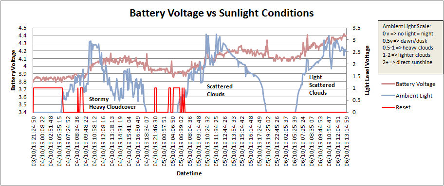
</div>  


This figure shows the LiPo typical charge curve supplied by the dfrobot battery manager.

<div align="center">
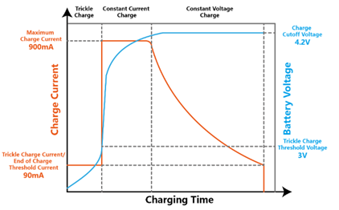
</div>  


###Communications
WiFi RF communications were selected as the communications technology of choice because WiFi modules are cheap and available (\$2) for the ESP8266.  The issue with WiFi is mainly that it is short range and thus only available within 20-30m of an AP.  What's more WiFi is using ISM bands so it can suffer from interference in crowded areas.  For a more long range solution there are several options, these were considered, but none met the cost criteria.

* Cellular => cellular is widely available and would enable the sensor station to be deployed in a much larger range of areas.  The issues are simply availability of cellular capable boards.  2G boards are the cheapest, but still cost upwards of $20.  3G-UMTS boards are $60+ and 4G-LTE boards are $100+.  For this reason, cellular, while being useful, was not cosidered for this project, however it would be the best choice in a real world scenario.
* LORA => after the terrible experience of trying to connect a lora shield to an arduino uno and then connect to the things network, this technology was not considered appropriate.  The main issue is that the the things network is a shared best effort network and service quality is very patchy.  Sometimes messages get though, someties not, despite having good RF.  For LORA to be effective, one would be forced to buy an LORA AP and then do the RF engineering to ensure a good link between the sensor and the AP.  All of this would end up costing money and time.  

Finally, using a LORA type technology forces one to use very compact data payload formats.  This is good for not affecting network capacity when many devices connect, but it is also troublesome.  Using WiFi allowed the luxury of simply sending as much ASCII format data as was desired, so it was easier to get going.

###Total Cost
While the goal was to create a cheap solution, the main sensor availability made this a difficult goal.  However, the total cost of the system turned out to be:

* MCU + ancilliary equipment ~ \$15
* WiFi ~ \$2
* Power Manager ~ \$12
* DCDC ~ \$8
* Battery ~ \$15
* Solar Panel ~ \$10
* Wind Sensors ~ \$70
* Mounting and Weather-proofing hardware ~ \$10 

The total cost was ~ \$70 for everything excluding the wind sensors and another \$70 for the wind sensors, thus the total was ~ \$140, which can't be considered that cheap.

In order to reduce the cost, the whole system should be designed into a custom pcb, requiring only a separate battery and solar panel.  This would enable the use of a smaller enclosure also.  However, the issue of the wind sensors is somewhat harder to solve.  Building the sensors from scratch would be the most effective way of reducing cost, possibly with 3D printing[7].  Ultasonic technology could also be investigated for wind speed and direction.

<P style="page-break-before: always">
###Mounting Location
Being a wind sensor, it is very sensitive to mounting location.  The sensor needs to be mounted above nearby obstacles and at least 10m away from larger structures, ideally much further.  If these mounting rules are not adhered to, the wind speed and direction will be inaccurate.  Wind direction esspecially will suffer from eddies and give variable readings.

<div align="center">
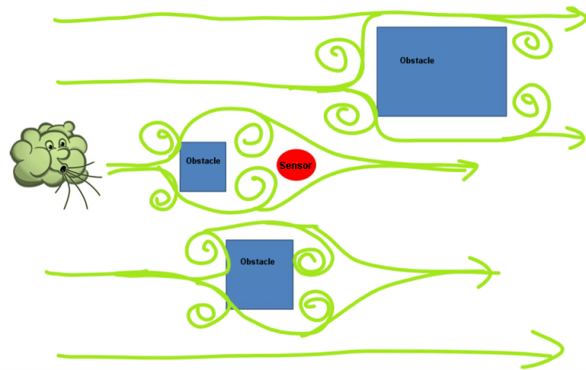
</div>  


###Usability of the data
The optimal way to expose the data to the end user is via a webserver and some kind of HTML-CSS-Javascript backed functionality.  HTML-CSS-Javascript offers leading edge graphics and user interactivity.  Ideally the data should be available via a dashboard where all the information is available in one page.  The current webserver only offers text based database access due to time constraints.

<div align="center">
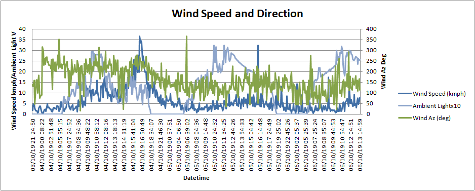
</div>  


<div align="center">
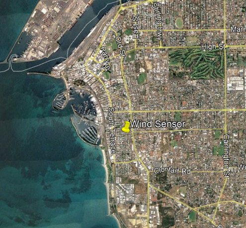
</div>  


---

#Conclusion
Making a standalone self powered IoT field device is definitely possible with readily available battery and solar technology.  There are however, serious challenges relating to connectivity, cost and reliability. For this prototype it has been demonstrated that such a device can be made successfully.  

It should be noted that in order to create power efficient devices, one needs to move away from user-freindly Arduino boards that effectively shield the end user from the harsh reality of the underlying electronics.  When dealing with raw IC chips and multiple devices sharing power supplies, a better understanding of electronics, volt-meters and oscilloscopes is required. 

Lastly, finding a location to mount the device is another challenge that may prove to be the one of most difficult to solve, as one would need the permission of the land/structure owner.  

Weather sensors in particular, unfortunately, are normally relegated to the realm of hobbyists due to the lack of perceived potential monetary gain.  However, some of the base technologies (weather-proofed enclosure, power self-sufficiency, radio communications) could be used as a platform for many different usage cases.

---

#References  
<style>
ol.custom-bullet {
    list-style: none;
}
ol.custom-bullet > li {
    vertical-align:middle;
    margin-bottom:10px;
    position: relative;
    left: -10px;
}
ol.custom-bullet > li:first-child {
    counter-reset:index;
}
ol.custom-bullet > li:before {
    content: "[" counter(index) "]";
    counter-increment:index;
    position: absolute;
    left: -30px;
    text-align: center;
}
</style>

<ol class="custom-bullet">
<li>https://www.electronicshub.org/update-flash-esp8266-firmware/</li>
<li>https://cordobo.com/2300-flash-esp8266-01-with-arduino-uno/</li>
<li>https://drive.google.com/open?id=1tD7IpE4rPMOWyQHP6xzjdRKjJAyeEZPj</li>
<li>https://www.instructables.com/id/How-to-change-fuse-bits-of-AVR-Atmega328p-8bit-mic/</li>
<li>http://www.gammon.com.au/breadboard</li>
<li>https://www.arduino.cc/en/Tutorial/ArduinoToBreadboard</li>
<li>https://blog.arduino.cc/2018/04/09/a-3d-printed-personal-weather-station/</li>
<li>https://blog.kkessler.com/2012/06/21/sparkfun-weather-station/</li>
</ol>

---

#Software Appendix 1
The actual code is shown below in logical sections.
Part 1: Setup commands
```{c eval=F}
#include <avr/sleep.h>
#include <avr/wdt.h>
#include <SoftwareSerial.h>
SoftwareSerial esp(9, 10);  //RX,TX
#include <dht.h>
dht DHT;

#define comms_rx_pin 0
#define comms_tx_pin 1
#define temp_meas_pin 2
#define w_spd_itr_pin 3
#define w_spd_pwr_pin 6
#define w_dir_pwr_pin 7
#define status_led_pin 8
#define comms_pwr_pin 13

#define light_sensor_meas_pin A0
#define w_dir_meas_pin A1
#define bat_meas_pin A2

#define KMPHPP 2.4    //kmph per pulse of the wind speed meter
#define BOUNCE_GUARD 500   //ignore wind speed pulses shorter than this in u-secs
#define VREF 5.1    ///vref should be = 5v = Vcc


//general program vars
String result;
bool trouble_flag = false;      //used to detect bad connectivity and wait it out
bool connected_flag = false;
bool http_ok_flag = false;
int i;    //global counter var, do nto use in functions

//basic control
bool testing = false;   //set to true for testing
bool wind_test = false;   //set to true for testing
bool startup_wifi_flag = false;    //set to true for the first time in a new ssid

//for wifi
String server_ip = "xxx.xxx.xxx.xxx";   //for external
int server_port = xxxx;       
String post_uri = "/data";
String ssid = "xxxxxxxxx";
String pwd = "xxxxxxxxx";

//timing vars
//NOTE: one dump cycle = (sleep_reps * 8 + meas_period_s) * meas_reps
#define meas_reps 5  //in reps how many measurement cycles to run for each dump
int meas_period_s = 6;      //how long (s) to activate the wind sensors for every measurement cycle
int sleep_reps = 6; //how many 8s reps to sleep the board each measurement cycle, 
int sleep_reps_min = 6;     //in reps of 8s
int sleep_reps_max = 20;     //in reps of 8s
int sleep_reps_delta = 100;    //in reps of 8s
int dump_rep_cnt = 0;
int meas_rep_cnt = 0;             //counts how many measurement reps have taken place

//wdt vars
int wdt_timeout_s = meas_period_s*meas_reps + 200; //sensor read time + max connect time
int wdt_timeout_reps = wdt_timeout_s/8;
volatile int wdt_timeout_rep_cnt = 0;

//sleep vars
bool sleep_flag = false;

//light sensor vars
double light_sensor_thd = 0.5;   //0.5;   //in volts
double light_sensor_v = 0.0;   //in volts

//battery meter vars
double bat_v = 0.0; //in volts
bool low_bat_flag = false;
double low_bat_thd = 3.3;

//temperature and humidity vars, temp in deg.C
double temp = 0.0;
double hum = 0.0;

//vars for use in the wind speed interupt routine
volatile unsigned long t_prev = 0.0;  //time of the previous pulse
volatile int pulse_cnt = 0;   //how many pulses
volatile double w_spd[meas_reps];
double w_spd_mean = 0.0;

//wind direction vars
double w_dir_mean = 0.0;
double w_dir_x[meas_reps];
double w_dir_y[meas_reps];

//These numbers are for a 5v Vref and a 5V Vcc and a 10K pullup resistor
int w_dir_raw_range[] = {66,84,92,127,184,244,287,406,461,600,631,702,786,827,889,946};
int w_dir_az[] = {1125,675,900,1575,1350,2025,1800,225,450,2475,2250,3375,0,2925,3150,2700};
```


Part 2: the interrupt handling code for the watchdog timer and sleep as well as the wind speed sensor.
```{c eval=F}
//ISR for wind speed
//these need volatile: w_spd[], pulse_cnt, t_prev
void on_wind_speed_pulse_interupt(){
  //this processes the wind speed pulse from the sensor, the pulses occur once per sensor rotation
  unsigned long t_now = micros();
  //check if we are starting the meas cycle again
  if (t_prev == 0){
    t_prev = t_now;      
  } 
  else{
    //get the duration since last function call
    unsigned long duration = t_now - t_prev;
    //only process if the duration is longer than the bounce protect, needed to filter out sensor switch bounce
    if (duration > BOUNCE_GUARD) {
      t_prev = t_now;   //only update t_prev if we accept the point a legit pulse
      pulse_cnt++;
      w_spd[meas_rep_cnt] += KMPHPP/((double)duration/1000000.0);
    }
  }
}

//ISR for wdt and for sleep
ISR (WDT_vect) {
  if (!sleep_flag) {
    //this is for the watchdog timer case
    wdt_reset();   //this should reset the curretn timer with all settings, not sure if it resets the settings too
    wdt_disable();
    wdt_timeout_rep_cnt++;
    //Serial.println("Interrupt: " + (String)wdt_timeout_rep_cnt + " of " + (String)wdt_timeout_reps + " Result = " + (String)(wdt_timeout_rep_cnt > wdt_timeout_reps));
    if (wdt_timeout_rep_cnt > wdt_timeout_reps){
      if (testing) Serial.println("TIMEOUT RESTARTING!!!");
      digitalWrite(comms_pwr_pin, LOW);
      wdt_enable(4); //we have timedout, so we need to reset
    }
    else{
      wdt_enable(9);   //set stadnard 8s wdt
      set_int_8s_no_reset();   //modify the 8s wdt
    }
  }
}

void set_int_8s_no_reset() {
  //you need to run this after you have enabled wdt to ensure you disable reset, if you do not, you will reset on timer expiry
  //WDIE = 1: Interrupt Enable
  //WDE = 1 :Reset Enable
  //WDP3 = 0 :For 1000ms Time-out
  //WDP2 = 1 :For 1000ms Time-out
  //WDP1 = 1 :For 1000ms Time-out
  //WDP0 = 0 :For 1000ms Time-out
  //WDCE=4,WDE=3,WDIE=6,WDP3=5,WDP2=2,WDP1=1,WDP0=0
  // same settings for wdt and sleep => 8s, interrupts and no reset
  cli();
  wdt_reset(); 
  MCUSR &= ~(1<<WDRF);
  WDTCSR |= (1<<WDCE) | (1<<WDE);  // Set WDCE and WDE to enable changes.
  WDTCSR = (1<<WDIE) | (0<<WDE) | (1<<WDP3) | (0<<WDP2) | (0<<WDP1) | (1<<WDP0);
  sei();
}

//sleep stuff
//###################################################################
void sleep_mcu(int reps){
  if (testing) Serial.println("starting sleep");
  int j=0;
  sleep_flag = true;
  for (j=0;j<reps;j++){
    set_sleep_mode(SLEEP_MODE_PWR_DOWN); // Set sleep mode.
    cli();
    sleep_enable();
    set_int_8s_no_reset();
    sleep_bod_disable();
    sei();
    sleep_cpu();
    //######################################
    // After waking from watchdog interrupt the code continues to execute from this point.
    //######################################
    sleep_disable();
  }
  sleep_flag = false;
  if (testing) Serial.println("sleep finished");
}
```


Part 3: Variable reset functions and some trig helper functions
```{c eval=F}
void reset_vars_dump_cycle(){
  //reset important variables after each data dump to WiFi
  int k;
  meas_rep_cnt=0;
  for (k=0;k<meas_reps;k++){
    w_spd[k] = 0.0;
  }
  for (k=0;k<meas_reps;k++){
    w_dir_x[k] = 0.0;
    w_dir_y[k] = 0.0;
  }
  temp = 0.0;
  hum = 0.0;
  bat_v = 0.0;
}

double correct_deg(double deg){
  if (deg < 0){
    return deg + 360.0;   
  }
  if (deg >= 360){
    return deg - 360.0;   
  }
  return deg;
}

double rad2deg(double rad){
  return correct_deg(rad*(180.0/M_PI));  
}

double deg2rad(double deg){
  return M_PI*deg/180.0;  
}
```


Part 4: Measure the Wind Direction, Temperature, Battery Level and Light Level
```{c eval=F}
void read_wind(){
  if (testing) Serial.print("Doing Wind...");
  double az_deg = -1.0;
  int k = 0;
  
  //start measurements
  //activate wind speed sensor
  pinMode(w_spd_pwr_pin, INPUT_PULLUP);  
  delay(100); 
  attachInterrupt(digitalPinToInterrupt(w_spd_itr_pin), on_wind_speed_pulse_interupt, FALLING);
  pulse_cnt = 0;
  t_prev = 0;

  //turn on the wind direction sensor
  digitalWrite(w_dir_pwr_pin, HIGH);
  delay(500);
  int tmp_wait = 200;    //ms between each successive wind dir meas   
  int tmp_cnt = 0;
  double w_dir_raw = 0;
  w_dir_raw=0.0;
  for(k=0; k<1000*meas_period_s/tmp_wait; k++){
    w_dir_raw += (double)analogRead(w_dir_meas_pin);
    delay(tmp_wait);
    tmp_cnt++;
  }
  //turn off the wind direction sensor
  digitalWrite(w_dir_pwr_pin, LOW);

  //deactivate the wind speed sensor
  detachInterrupt(digitalPinToInterrupt(w_spd_itr_pin));
  pinMode(w_spd_pwr_pin, OUTPUT);   
  digitalWrite(w_spd_pwr_pin, LOW);

  //process the wind speed results
  //###############################################
  if (pulse_cnt == 0) w_spd[meas_rep_cnt] = 0;  //test if wind speed is too low to accurately measure
  else w_spd[meas_rep_cnt] = w_spd[meas_rep_cnt]/(double)pulse_cnt;  //if ok

  //process the wind direction measurements
  //###############################################
  w_dir_raw = w_dir_raw/(double)tmp_cnt;
  
  //this looks for the closest match, if it finds one within 4 points of the nominal, it goes for it straight away,
  //otherwise, it just finds the closest and returns that
  int min_delta=1024;
  int min_index=8;
  for (k=0;k<16;k++){
    int delta = min(abs(w_dir_raw - w_dir_raw_range[k]), abs(w_dir_raw+1023 - w_dir_raw_range[k]));
    if (delta < 4){
       az_deg = (double)w_dir_az[k]/10.0;
       break;
    }
    if (delta < min_delta){
      min_delta = delta;
      min_index = k;
    }
  }
  if (az_deg == -1.0){
    az_deg = (double)w_dir_az[min_index]/10.0;
  }

  //process the w_dir results
  w_dir_x[meas_rep_cnt] = sin(deg2rad(az_deg));
  w_dir_y[meas_rep_cnt] = cos(deg2rad(az_deg));

  if (testing) Serial.println((String)az_deg + ", " + (String)w_spd[meas_rep_cnt]);
}

void read_bat_lev(){
  int bat_meas = 0;
  bat_meas = analogRead(bat_meas_pin);
  bat_v += (double)VREF*((double)bat_meas+1.0)/1024.0;  
}

void read_temp_hum(){
  //read the raw value
  DHT.read11(temp_meas_pin);
  temp += DHT.temperature;
  hum += DHT.humidity;
}
```


Part 5: Post Process the measured data, does wind speed weighted wind direction vector addition here
```{c eval=F}
void pre_dump_processing(){
  int k;

  //this does the wind speed
  w_spd_mean=0;
  for (k=0;k<meas_reps;k++){
    w_spd_mean += w_spd[k]; 
  }
  w_spd_mean = w_spd_mean/(double)meas_reps;

  double w_dir_x_mean = 0;
  double w_dir_y_mean = 0;
  w_dir_mean=0;
  //this does the wind dir, mean weighted by w_spd
  for (k=0;k<meas_reps;k++){
    if (w_spd_mean != 0.0) {
      //do an weighted mean
      w_dir_x_mean += w_dir_x[k]*w_spd[k]; 
      w_dir_y_mean += w_dir_y[k]*w_spd[k]; 
    }
    else{
      //do an unweighted mean
      w_dir_x_mean += w_dir_x[k]; 
      w_dir_y_mean += w_dir_y[k]; 
    }
  }
  w_dir_x_mean = w_dir_x_mean/(double)meas_reps; 
  w_dir_y_mean = w_dir_y_mean/(double)meas_reps; 
  w_dir_mean = rad2deg(atan2(w_dir_x_mean, w_dir_y_mean));

  //this does the temp/hum/batt
  temp = temp/(double)meas_reps;
  hum = hum/(double)meas_reps;
  bat_v = bat_v/(double)meas_reps;
}
```


Part 6: Adjust the sleep period
```{c eval=F}
void adjust_sleep_cycle_length(){
  //handles low battery states
  if (bat_v < low_bat_thd) low_bat_flag = true;
  else if (bat_v > (low_bat_thd + 0.2)) low_bat_flag = false;

  // read the value from the sensor, returns int from 0-1023 maps from 0 to vref(5v):
  int light_sensor_meas = analogRead(light_sensor_meas_pin);
  
  //normal case
  if (!trouble_flag & !low_bat_flag){
    //adjust the sleep time based on the abient light, longer for lower light, shorter for more light
    light_sensor_v = (double)VREF*((double)light_sensor_meas + 1.0)/(double)1024;
    if (light_sensor_v <= light_sensor_thd){
      //sleep_reps = min(sleep_reps_max, sleep_reps + sleep_reps_delta);
      sleep_reps = sleep_reps_max;
    }
    if (light_sensor_v > light_sensor_thd){
      //sleep_reps = max(sleep_reps_min, sleep_reps - sleep_reps_delta);
      sleep_reps = sleep_reps_min;
    }  
    //helps battery charge
    if (bat_v < 4.0){
      sleep_reps = sleep_reps*2;
    }
  }
  else {
    //connectivity trouble case
    if (trouble_flag & !low_bat_flag){
      int mult_factor = 2;
      //we increase the sleep to max quickly
      //sleep_reps = min(sleep_reps_max, sleep_reps + mult_factor*sleep_reps_delta);
      sleep_reps = sleep_reps_max;
      if (bat_v < 4.0){
        sleep_reps = sleep_reps*2;
      }
    }
    //low battery case
    else{
      sleep_reps = 3600/8/meas_reps;   //1 hour sleep as low_bat_flag is active
      for (int k=0;k<4;k++){
        digitalWrite(status_led_pin, HIGH);
        delay(1000);
        digitalWrite(status_led_pin, LOW);
        delay(1000);
      }
    }
  }
}
```


Part 7: WiFi handling functions => Setup, Connect, Post, Wait for Response
```{c eval=F}
void reset_wifi() {
  if (testing) Serial.println("resetting wifi board");
  esp.println("AT+RST");
  get_result_fast(5000);
}

void set baud_rate(){
  //use this to set the baud rate
  digitalWrite(comms_pwr_pin, HIGH);
  esp.begin(115200);  //this assumes default baud rate is used by the module
  delay(1000);
  esp.println("AT+UART_DEF=9600,8,1,0,0");
  delay(1000);
  esp.end();
  delay(1000);
  esp.begin(9600);  
  delay(3000);
  digitalWrite(comms_pwr_pin, LOW);
}

int setup_wifi_full(){
  //test the cipmux setting
  if (testing) Serial.println("setting up wifi board");
  esp.println("AT+CIPCLOSE");
  get_result_fast(500);
  esp.println("AT+CIPMUX=0");   // 0 for single TCP connection mode, 1 for multi TCP connection mode
  get_result_fast(500);
  esp.println("AT+CIPMODE=0");   // 0 for normal transfer mode
  get_result_fast(500);

  //these commands are stored in memory, so you only need once
  esp.println("AT+CWMODE_DEF=1");   // 1 for wifi client mode
  get_result_fast(500);
  esp.println("AT+CWAUTOCONN=1");   //set to 0 to not auto connect to ap on power on 
  get_result_fast(500);

  //only need this once to set params, then do not need
  //board will automatically connect to the stored hotspot after this
  connect_wifi();

  //all ok
  return 1;
}

int setup_wifi_fast(){
  //test the cipmux setting
  if (testing) Serial.println("setting up wifi board");
  esp.println("AT+CIPCLOSE");
  get_result_fast(100);
  esp.println("AT+CIPMUX=0");   // 0 for single TCP connection mode, 1 for multi TCP connection mode
  get_result_fast(100);
  esp.println("AT+CIPMODE=0");   // 0 for normal transfer mode
  get_result_fast(100);
  //all ok
  return 1;
}


int connect_wifi() {
  if (testing) Serial.println("Disconnecting from current AP");
  esp.println("AT+CWQAP");
  get_result_fast(3000);

  //connect to the desired ssid
  if (testing) Serial.println("Connecting to target AP");
  esp.println("AT+CWJAP_DEF=\"" + ssid + "\",\"" + pwd + "\"");
  get_result_slow(4000, 3);
  if (result.indexOf("OK")!=-1 | result.indexOf("WIFI CONNECTED")!=-1){
    if (testing) {
      Serial.println("Connect OK");
      Serial.println("result: " + result);
    }
    return 1;    //connect ok
  }
    
  //could not connect error
  if (testing) {
    Serial.println("Could Not Connect Error");
    Serial.println("result: " + result);
  }
  return 0;
}


int http_post(){
  /*
  //list all available APs rssi and ch .. for testing
  esp.println("AT+CWLAPOPT=1,127");
  delay(1000);
  esp.println("AT+CWLAP");
  esp.println("AT+CIFSR");
  get_result_fast(5000);
  Serial.println(result);
  */
  
  //get the RSSI
  String rssi = "-1";
  esp.println("AT+CWJAP?");
  get_result_fast(1000);
  if (result.indexOf(",-")!=-1){
    rssi = result.substring(result.indexOf(",-")+1, min(result.length(),result.indexOf(",-")+5));
    rssi.trim();
  }

  //prepare the data payload
  String data_vals = "wspd_mean=" + (String)w_spd_mean + 
              "&wdir_mean=" + (String)w_dir_mean + 
              "&temp=" + (String)temp +
              "&hum=" + (String)hum + 
              "&rep_cnt=" + (String)dump_rep_cnt + 
              "&light_lev=" + (String)light_sensor_v +
              "&batt_lev=" + (String)bat_v + 
              "&rssi=" + rssi;
  if (testing) Serial.println(data_vals);

  //start a TCP connection.
  if (testing) Serial.println("Establish TCP");
  esp.println("AT+CIPSTART=\"TCP\",\"" + server_ip + "\"," + server_port + ",0");  //last value is the TCP keep alive counter in s, 0 to disable
  get_result_fast(3000);   //5000;
  if (testing) Serial.println(result);
  if (result.indexOf("ERROR") != -1){   // && result.indexOf("no ip") != -1){
    return 0;
  }
  
  //test that we activated the TCP or it is already activated, then we are good to proceed
  if (result.indexOf("OK")!=-1 || result.indexOf("ALREADY")!=-1){ 
    String cmd1 = "POST " + post_uri + " HTTP/1.1";
    String cmd2 = "Host: " + server_ip + ":" + (String)server_port;
    String cmd3 = "Content-Type: application/x-www-form-urlencoded";
    String cmd4 = "Content-Length: " + (String)data_vals.length();
    String cmd5 = "";

    //need to add the carriage return and new line (2 chars onto each line)
    int len = cmd1.length() + 2 + 
              cmd2.length() + 2 + 
              cmd3.length() + 2 + 
              cmd4.length() + 2 + 
              cmd5.length() + 2 + 
              data_vals.length() + 2;
          
    //determine the number of caracters to be sent.
    if (testing) Serial.println("Sending HTTP Msg");
    esp.print("AT+CIPSEND=");
    esp.println(len);
    //flush rx buffer
    get_result_fast(1000);   //2000;
    
    //send request
    esp.println(cmd1);
    delay(300);    
    esp.println(cmd2);    
    delay(300);    
    esp.println(cmd3);    
    delay(300);    
    esp.println(cmd4);    
    delay(300);    
    esp.println(cmd5);    
    delay(300);    
    esp.println(data_vals);    
    delay(3000);    

    //close the connection
    esp.println("AT+CIPCLOSE");
    get_result_fast(1000);   //5000;
    if (result.indexOf("ERROR")==-1){
      if (testing) Serial.println(result);
      return 1;    //was send ok
    }
  }

  //send not successfull
  return 0;    //bad sending result error
}


//gets the result from the serial rx in difficult cases
String get_result_slow(int del, int cnt){
  int k;
  String res_new;
  
  result = "";
  delay(del);
  if (trouble_flag) delay(15000);
  for (k=0;k<20;k++){
    res_new = esp.readString();
    if (res_new == "") {
      cnt = cnt - 1;
      if (cnt == 0) break;
    }
    result += res_new;
    delay(1000);
  }
}

//gets the result from the serial rx
void get_result_fast(int start){
  result = "";
  delay(start);
  while(esp.available()){
    result = esp.readString();
    delay(500);
  }
}
```


Part 8: The actual Setup and Loop Functions to tie everything together
```{c eval=F}
void setup()
{
  analogReference(VREF);

  if (testing) {
    Serial.begin(9600);
    Serial.println("###########START############");
  }
  pinMode(status_led_pin, OUTPUT);
  
  //indicator led on startup
  for (i=0;i<10;i++){
    digitalWrite(status_led_pin, HIGH);
    delay(100);
    digitalWrite(status_led_pin, LOW);
    delay(100);
  }

  //temperature setup
  DHT.read11(temp_meas_pin);
  delay(2000); 
  
  //wind sensor setup
  pinMode(w_spd_pwr_pin, OUTPUT);
  digitalWrite(w_spd_pwr_pin, LOW);    //off the sensor initally
  pinMode(w_dir_pwr_pin, OUTPUT);
  digitalWrite(w_dir_pwr_pin, LOW);    //off the sensor initally

  //setup wdt
  wdt_enable(9);
  set_int_8s_no_reset();
  wdt_timeout_rep_cnt = 0;    //start the watchdog timer

  //wifi setup
  pinMode(comms_pwr_pin, OUTPUT);
  digitalWrite(comms_pwr_pin, LOW);
  esp.begin(9600);
  if (startup_wifi_flag){
    digitalWrite(comms_pwr_pin, HIGH);
    delay(1000);
    setup_wifi_full();
    digitalWrite(comms_pwr_pin, LOW);
    delay(1000);
  }
  wdt_timeout_rep_cnt = 0;    //start the watchdog timer
}

//###########################################################################
void loop() {
  //test for a low battery situation
  bat_v = 0;
  for(i=0;i<3;i++){
    read_bat_lev();
    delay(200);
  }
  bat_v = bat_v/3.0;
  if (testing) Serial.println(bat_v);
  adjust_sleep_cycle_length(); //set the sleep reps based on the ambient light level and battery level  
  if (!low_bat_flag){
    //we have good battery voltage, so carry on
    reset_vars_dump_cycle();
    if (testing) Serial.println("Starting Measurements");
    for (i=0; i<meas_reps; i++){
      //#####DO MEASUREMENTS###################
      digitalWrite(status_led_pin, HIGH);
      delay(50);
      digitalWrite(status_led_pin, LOW);
  
      if (!wind_test) read_wind();
      else delay(2000);
      read_temp_hum();
      read_bat_lev();
      meas_rep_cnt++;
    }
  
    //######PROCESS AND DUMP###########
    //#############################################3
    //process measurements  
    if (testing) Serial.println("Data Processing");
    pre_dump_processing();
    if (wind_test){
      //just randomly make up some numbers for testing
      w_spd_mean = (double)random(0,30);
      w_dir_mean = (double)random(0,359);
    }
  
    //#############################################3
    //activate the comms and send
    if (testing) Serial.println("Activating Comms");
    digitalWrite(comms_pwr_pin, HIGH);
    delay(2000);  //give it time to connect
    setup_wifi_fast();
    
    //try to connect 3 times, then go into connectivity trouble mode where we wait it out with longer sleep intervals
    connected_flag = false;
    http_ok_flag = false;
    if (!trouble_flag){
      //try to post
      for (i=0;i<5;i++){
        if (http_post() == 1){
          http_ok_flag = true;
          break;
        }
      }
      if (!http_ok_flag){
        //could connect but could not send data
        trouble_flag = true;
        if (testing) Serial.println("HTTP fail, Trouble Flag Has Been Activated");
      }
    }
    else{
      //we are in trouble mode, so try only once and then give up
      if (connect_wifi() == 1){
        if (http_post() == 1){
          trouble_flag = false;
          if (testing) Serial.println("Trouble Flag Has Been Deactivated");
        }
      }
    }
    if (testing) Serial.println("Deactivating Comms");
    digitalWrite(comms_pwr_pin, LOW);
    delay(100);
    //increment the dump rep count to know how many dump reps were done before hte board died and reset itself
    dump_rep_cnt++;
  }

  //#############################################3
  //sleep the board
  if (testing) Serial.println("Sleeping the Board");
  wdt_disable();   //disable the wtc function
  delay(300);
  sleep_mcu(sleep_reps*meas_reps);   //go to sleep
  //sleep_mcu(10);   //go to sleep
  //#############################################3
  //###SLEEPING HERE###  
  //#############################################3
  //prep the board after wakeup
  digitalWrite(status_led_pin, HIGH);
  delay(300);
  digitalWrite(status_led_pin, LOW);

  digitalWrite(comms_pwr_pin, LOW);
  delay(500);
  wdt_enable(9); 
  set_int_8s_no_reset();   
  wdt_timeout_rep_cnt = 0;    //start the watchdog timer
}
```

---

#Software Appendix 2
These are the SQL and data handling functions running on the RP.
```{Python eval=F}
from flask import Flask, url_for, escape, g, request, render_template, send_from_directory, jsonify
from flask_cors import CORS, cross_origin
import sqlite3
import json
from datetime import datetime as dt

def run_sql(db, sql, get_response=False, header=False):
	response = 'ok'
	try:
	    with sqlite3.connect(db) as db_conn:
	        cur = db_conn.cursor()
	        cur.execute(sql)
		if get_response:
			response = cur.fetchall()
		
		if header:
			cols = [tuple([description[0] for description in cur.description])]
			return cols + response
		else:
			return response
	except Exception as e:
		return 'error: ' + str(e)
	
def data_processor(data, schema):
	#converts the incoming dict to a string for db update
	#check data format is ok
	if len(data) != len(schema_list): return None
	#note: dt.now() gives the current time, dt.utcfromtimestamp(0) gives the time at 0:0:0 1/1/1970
	dt_now = dt.now()
	datetime_str = dt_now.strftime('%d/%m/%y %H:%M:%S')
	secs_since_1970 = int((dt_now - dt.utcfromtimestamp(0)).total_seconds())
	data_str = '{0},"{1}"'.format(secs_since_1970, datetime_str)
	for item in schema:
		if item not in data: return None
		data_str += "," + str(data[item])
	return data_str
```

This creates the web app and defines the homepage
```{Python eval=F}
app = Flask(__name__, static_url_path='')
CORS(app)
db_path = '/home/pi/weather_ap/weather.db'
schema_list = ['wspd_mean', 'wspd_sd', 'wdir_mean', 'wdir_sd', 'temp', 'hum', 'light_lev', 'batt_lev','rssi'] 

@app.route('/')
def homepage():
    return send_from_directory('static', 'index.html')
```


This is to handle POST requests from the MCU
```{Python eval=F}
@app.route('/data', methods = ['POST'])
def rx_data():
	if request.method != 'POST': 
		return 'nok'
        
	#this will read in all the post data as a dict
        data = request.form
	print(data)
	#convert it to a string
	data_str = data_processor(data, schema_list)
	if data_str is None: return 'nok'
	#build the sql command and send it
	sql = 'insert into data values({0});'.format(data_str)
	response = run_sql(db_path, sql, get_response=False, header=False)    
	return response
```

This is to handle user requests from the database
```{Python eval=F}
#usage: http://ip:port/db/24  ... or use last for the most recent value
@app.route('/db/<hrs>')
def show_db(hrs):
	if hrs == 'last':
		sql = 'SELECT * FROM data ORDER BY datetime_sec DESC LIMIT 1;'
	else:
		#this will show the data for the last N hours
		secs_since_1970 = int((dt.now() - dt.utcfromtimestamp(0)).total_seconds())
		time_thd = secs_since_1970 - 3600*int(hrs)
		sql = 'select * from data where datetime_sec > {0};'.format(time_thd)
	response = run_sql(db_path, sql, get_response=True, header=True)    
	return render_template("sql_select.html", data = response);
        #return jsonify(response)
```

This actually runs the flask webserver
```{Python eval=F}
if __name__ == '__main__':
    app.run(host='0.0.0.0', port=5000, debug=True)
```

